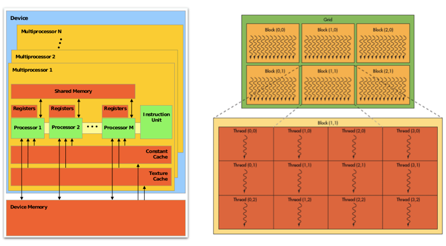

<big>

CSC 453: Code transformations for GPU race detection with llvm-py
=======

Dong Chen

Introduction
-----------

Code transformations are widely used in performance concerned optimizations, programming productivity and so on. LLVM infrastructure is often used. But C++ abased interface is hard to be used during the development. Here we use LLVM-py interface to do code transformations for GPU race detection.

Architecture and execution model of GPU
---------------------------------------

The hardware structure of GPU consists of two major parts: processing part and hierarchical memory part. The processing part is referred as streaming multiprocessors(SM). Each GPU contains a number of SMs and each SM contains an array of streaming processors(SP). The hierarchical memory has three levels: device memory, shared memory and private memory. Device memory can be accessed by all the SPs in every SMs. Each SM has its own shared memory which can be accessed by all the SPs belong to the SM. Each SP has it own private memory which can only be access by itself.

GPU programs contain two parts: the main program and the kernel program. The main program will do initialization, copy data from main memory to device memory, launch kernel program on GPU and copy data back from device memory to main memory once the kernel program finished running. Kernel program will be mapped into thousands of threads. And threads are organized in thread blocks. Thread blocks will be assigned to each SM to execute and threads in the same thread block will be executed on the array of SPs in warps.

So threads in GPU can share data on shared memory and device memory. Data races will occur if synchronization is not correctly used. But current compiler can not detect races.

GPU Races detection by two-pass run
----------------------------------

Our approach is to detect GPU races by transforming the kernel program and run it on GPU. Two runs are needed: one is to detect write-write races and the other is to detect write-read races. In the first run, we first copy the shared data for each warp and run the threads on their private copies. Then compare the result, if the write regions are not overlapping, it means no write-write races. Else write-write races will happen. The second pass will use the result of the first run as the initial state. Then run and compare, if different, write-read race will happen.

Code transformations needed
---------------------------

1. iterating through AST and replacing variables

 	* instructions for declaring new variables

			int a;         --->     int a[M]
			int a[N]; 	   --->     int a[M][N]

  	* instructions for access redirection
  	
  			a              --->      a[warpID] 
  			a[i]           --->      a[warpID][i]        

2.  inserting functions to do memory copy, memory compare
	
	* 
	
			region_copy();
			union_copy();
			region_diff();

Update Post 1
------------

llvmpy can be easily used to generate LLVM IR code, so inserting LLVM IR code of the functions is a good choice. The first step is to generate the functions which will be called by kernels for race detection. Let's take <i>region_copy()</i> as an example, the original C code of <i>region_copy()</i> is listed below, it will copy the data from <i>orig_src</i> to <i>new_copy</i> in parallel:
		
		void warp_level_parallel_memcpy( int tid,
                       char * dst, char * src, int size)
		{
   			int * opt_dst = (int *) dst ;
    		int * opt_src = (int *) src ;
    		int opt_size  = size / sizeof(int) ;

    		int ttid = tid % WARP_SIZE;
    		for (int k=0; k< (opt_size / WARP_SIZE)+1; k ++ ) {
        		int idx = ttid + WARP_SIZE * k ;
        		if ( idx < opt_size )
           			opt_dst[idx] = opt_src[idx] ;
    		}
    		__syncthreads() ;
		}

		void region_copy( int block_id, int tid, char * orig_copy, int size,
                     char * new_copy, char * union_copy)
		{
    		warp_level_parallel_memcpy( tid, new_copy, orig_copy, size ) ;
		}

Writing the above functions in llvmpy is quite straight forward, but should be in the form of LLVM IR. In LLVM IR, functions are contained in modules. Each function should contain at least one "entry" basic block. The instructions are inserted to each basic block of the function in order.

The skeleton is listed below. 

1. Define data types and function types. llvmpy provides Type object to define the data types and function types. 
		
		#define "int" type
		intty = Type.int(32)
		
		#define "char *" type 
		charty = Type.pointer(Type.int(8))
		
		#define function type which is "void FUNCTION(int, int, char *, int, char *, char *)"
		fnty = Type.function(Type.void(), [intty, intty, charty, intty, charty, charty])
			
3. Define a function based on one function type
		
		region_copy = Function.new(mod, fnty, name='region_copy')
	
4. Setting the arguments. In llvmpy, the arguments of one function can be return just by assignment. And the attributes of each argument can be easily modified.
		
	
		arg0, arg1, arg2, arg3, arg4, arg5 = region_copy.args
		region_copy.args[0].name = "block_id"
	
5. Define basic block in one function and inserting instructions
			
		#inserting basic block
		enblk = region_copy.append_basic_block("entry")
		
		#inserting instructions
		a = bldr.alloca(intty)    # %0 = alloca i32, align 4
		a.alignment = 4
		a_store = bldr.store(arg0, a) # store i32 %block_id, i32* %0
		
		#inserting instruction for function call
		bldr.call(warp_level_parallel_memcpy,[load_b, load_e, load_c, load_d])

<b>Summary:</b>

What can be done for now(easiest):

All the functions which will be used in the GPU Race detection can be generated. The llvmpy code is listed <a href="https://github.com/dongchen-coder/dongchen-coder.github.io/blob/master/gpuRaceDetection.py">here</a>.
The generated code is listed <a href="https://github.com/dongchen-coder/dongchen-coder.github.io/blob/master/gpuRaceDetection.ll">here</a>.

What should be done next(sort from easy to hard):

1. Find the way to analysis the code, which means find whether there is way to iterating over the code.
2. Find the way to insert instructions, such as function calls, new variables, and so on.
3. Find the way to replace variables in instructions.

But for now, whether llvmpy supports analysis is still need to be explored. Pass manager part of llvmpy should be further checked.

Update Post 2 (Outline)
------------

1. iterating over code (LLVM IR), LLVM IR level analysis can be performed
	
		for f in mod.functions:
    		for bb in f.basic_blocks:
        		for istr in bb.instructions:
            		for operand in istr.operands:
         
2. build compiler yourself (<a https://github.com/dongchen-coder/dongchen-coder.github.io/blob/master/kaleidoscope.py">kaleidoscope</a>)

		tokenizer
		lexer
		paser (AST can be generated here)
		code generator

Result:
	
Array access analysis (<a href="https://github.com/dongchen-coder/dongchen-coder.github.io/blob/master/arrayAccessAnalysis.py">source code</a>) of GPU kernel program:

GPU kernel program of matrix multiply (<a href="https://github.com/dongchen-coder/dongchen-coder.github.io/blob/master/matrixMul.c">C</a>, <a href="https://github.com/dongchen-coder/dongchen-coder.github.io/blob/master/matrixMul.ll">LLVM IR</a>) 

results:

	Array aacess analysis result:
	A = a + wA * ty + tx
	B = b + wB * ty + tx
	C = wB * 32 * by + 32 * bx + wB * ty + tx

	
	
	
	

</big>