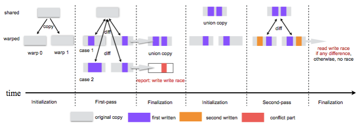

Proposal for CSC 453: Code transformations for GPU race detection with llvm-py
=======

Dong Chen

Introduction
-----------

Code transformations are widely used in performance concerned optimizations, programming productivity and so on. LLVM infrastructure is often used. But C++ abased interface is hard to be used during the development. Here we use LLVM-py interface to do code transformations.

Architecture and execution model of GPU
---------------------------------------

The hardware structure of GPU consists of two major parts: processing part and hierarchical memory part. The processing part is referred as streaming multiprocessors(SM). Each GPU contains a number of SMs and each SM contains an array of streaming processors(SP). The hierarchical memory has three levels: device memory, shared memory and pravite memory. Device memory can be accessed by all the SPs in every SMs. Each SM has its own shared memory which can be accessed by all the SPs belong to the SM. Each SP has it own private memory which can only be access by itself.

GPU programs contain two parts: the main program and the kernel program. The main program will do initialization, copy data from main memory to device memory, launch kernel program on GPU and copy data back from device memory to main memory once the kernel program finished running. Kernel program will be mapped into thousands of threads. And threads are organized in thread blocks. Thread blocks will be assigned to each SM to execute and threads in the same thread block will be executed on the array of SPs in warps.

So threads in GPU can share data on shared memory and device memory. Data races will occur if synchronization is not correctly used. But current compiler can not detect races.

GPU Races detection by two-pass run
----------------------------------

Our approach is to detect GPU races by transforming the kernel program and run it on GPU. Two runs are needed: one is to detect write-write races and the other is to detect write-read races. In the first run, we first copy the shared data for each warp and run the threads on their private copies. Then compare the result, if the write regions are not overlaping, it means no write-write races. Else write-write races will happen. The second pass will use the result of the first run as the initial state. Then run and compare, if different, write-read race will happen.

Code transfermations needed
---------------------------

1. inserting instructions and functions.

  * instructions for declaring new variables for copying

  * instructions for copying data to declared variables

  * functions for comparing

2. iterating through AST and replacing variables

  * redirect the access to private copies
